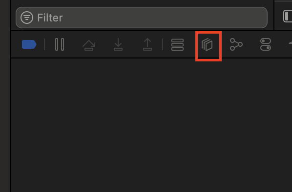

내일배움캠프 iOS 마스터 Day 18


#내일배움캠프 #iOS #TIL #오토레이아웃 #append(contentsOf:)


## 내일배움캠프 iOS 마스터 부트캠프 7기

## Day 17

### 주요 활동
- 알고리즘 풀기
- 앱개발 강의 듣기
    + 1-5강~
- HIG특강

### 주요 학습내용

- UI 버튼 백그라운드 컬러를 변경했는데 안바뀐 이유

`self.button.backgroundColor = .green`로 제어하면 모서리만 살짝 바뀌고 버튼에 레이어가 하나 더 위에 있는것처럼 기본색이 바뀌지 않음

버튼 객체에는 여러가지 레이어가 있고 일반적으로 백그라운드 라고 생각했던 영역은
`.tintColor`로 제어 가능

예제 코드

```swift
 @IBAction func buttonAction(_ sender: Any) {
            self.button.tintColor = .red
            self.button.backgroundColor = .green
        
    }
```

여러 레이어가 있으니 학습하면서 익히기


디버그 콘솔에서 위 버튼을 누르면


위와 같이 UI에 존재하는 레이어 층들을 확인할 수 있다.

`.tintColor`가 빨강
`.backgroundColor`가 초록임을 확인할 수 있다.

---

- `imageView.contentMode = .scaleAspectFit` 구문을 넣는 이유

`contentMode`의 기본값은 `.scaleToFill`인데 이 값은 이미지 비율을 무시하고 뷰에 강제로 맞추기 때문에 이미지가 찌그러져서 보일 수 있음

학습단계에서는 `.scaleAspectFit`을 사용해서 이미지가 찌그러지지 않고 비율을 맞추면서 전체가 보이게 하는 것

- `@objc`

@objc는 Swift 코드를 Objective-C 런타임에 노출시키기 위한 특수한 속성(attribute)

Swift 함수가 Objective-C 런타임의 selector(예: 버튼 액션)와 연동되기 위해 필요

스위프트에서는 어노테이션이 아니라 속성(attribute)이라고 부른다.(스위프트 공식문서)

예제
```swift
@IBAction func buttonTapped(_ sender: UIButton) {
    print("버튼이 눌렸습니다")
}

//$IBaction이 컴파일러가 내부적으로 @objc를 추가해줌

button.addTarget(self, action: #selector(buttonTapped(_:)), for: .touchUpInside)

@objc func buttonTapped(_ sender: UIButton) {
    print("버튼 눌림")
}

//코드에서 직접 사용할 때는 @objc를 명시

```


### 6/16 예상일정

- 알고리즘 풀이
- 앱개발 강의
    + 1-5강 ~ 

velog주소
